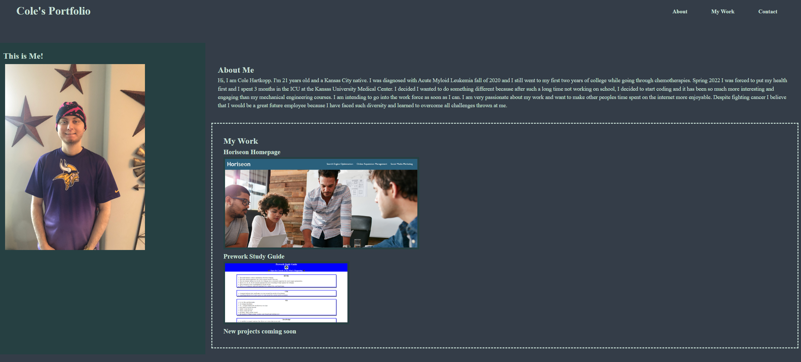

# Challenge 2, My Portfolio

## Description
This project was so that future employers, colleages, and teachers can visit a webpage that has all of my previous projects and challenges linked in one place. By having all of my work organized in one location then employers can see a library of previous work and they can gauge if I would be a good fit in their company. I was motivated to make this portfolio because it is similar to a buisness card in the fact that there are all my contact information linked at the bottom but this webpage provides much more than a little card. Not only does the webpage have information on how to contact me but it includes a photo of myself, a short paragragh about myself, and all my previous work. So employers kind of get to know me before ever meeting me. I learned a lot of CSS to complete this webpage, I did my best to keep it simple so if others were to look at my code then they should be able to follow the semantics. This challenge stands out because I have only just started coding and only have one project to add to my portfolio but I designed it so that when I finish future coding challenges and projects then I can very easily add them to the work section on my webpage and it will follow the design of the webpage.

## Usage
Starting from scratch was a big step for me but this is very important practice for becoming a full stack developer. In the work place I might have to start from scratch and this challenge was good practice at that, including multiple pushes to git. Knowing how to begin from nothing is a valuable skill that all full stack developers should have.

Check out my portfolio here [My Portfolio](https://zencoh.github.io/my-portfolio/)

